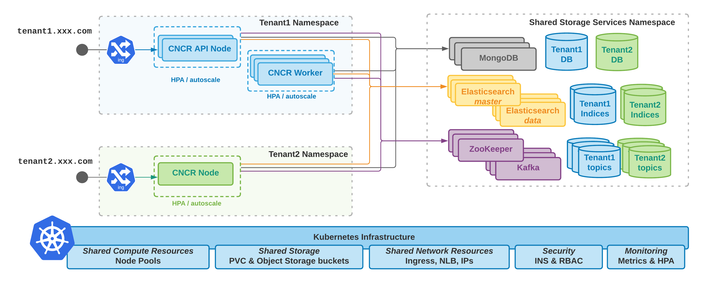

# About

This repository is a derivative of [nuxeo-helm-chart](https://github.com/tiry/nuxeo-helm-chart) with the aim to provide a way to deploy CNCR instead of Nuxeo.

This repository contains a basic Helm chart to deploy CNCR but also additional charts and helm resources to:

 - deploy a shared storage layer
    - MongoDB cluster
    - Elasticsearch Cluster
    - Kafka Cluster
 - manange automatic deployment updates
    - leveraging [Keel](https://keel.sh/)
 - manage monitoring
    - leveraging [Grafana](https://grafana.com/)
 - manage autoscaling
    - leveraging K8S HPA

## About Helm and Shell scripts

In order to deploy the differents pieces, multiple Helm Charts are needed.
These differents charts share some variables.

To solve this problem the defaulr Nuxeo Helm Chart relies on [HelmFile](https://github.com/roboll/helmfile).

In order to facilitate a future integration inside an automation based on Scripting and Terraform, this repository uses basic Shell sccripting.

This is not super nice, but for now it should get the job done.

You should find below information to:

 - deploy the shared storage layer with a configuration *closer* to production
    - HA setup + persistence (PVC and StatefulSet) 
    - see values files in the [storage](storage) directory
    - see the `deploy-storage.sh` script
 - provide sample configuration for multiple tenants
    - shared configuration
    - per-tenant configuration
    - see values files in the [tenants](tenants) directory
    - see the `deploy-tenantX.sh` scripts
 - deploy monitoring and a grafana dashboard
    - see the [monitoring](monitoring) folder and associated [ReadMe](monitoring/ReadMe.md)
 - configure pod autoscaling
    - see [hpa](hpa) folder and associated [ReadMe](hpa/ReadMe.md)
 - configure TLS encryption using letsencryt or static wildcard certificates
    - see [tls-ingress](tls-ingress) folder and and associated [ReadMe](tls-ingress/ReadMe.md)
 
The diagram below provides a logical overview of the deployed pods and services.

# K8S Setup 

## Helm 3

Helm3 needs to be available in your (client environment).

## Install ingress controller Nginx

You need to deploy an ingress controller in your K8S cluster.
We use Nginx in order to be as platform-agnostic as possible.

    kubectl apply -f https://raw.githubusercontent.com/kubernetes/ingress-nginx/master/deploy/static/provider/kind/deploy.yaml

    kubectl wait --namespace ingress-nginx \
      --for=condition=ready pod \
      --selector=app.kubernetes.io/component=controller \
      --timeout=90s

# Deploy the Nuxeo Cluster

## Principles used to deploy multiple Nuxeo applications

### Shared storage

The shared storage services (mongodb, elasticsearch, kafka, redis ...) are deployed in a dedicated namespace (for ample `nx-shared-storage` namespace).

Each new tenant is composed of:

 - Nuxeo pods running in a dedicated *"tenant"* namespace 
 - a new storage space allocated inside the shared storage layer
    - `<tenant>` database in MongoDB
    - `<tenant>-` prefix for Elasticsearch indexes
    - `<tenant>-` prefix for Kafka topic

The assumption is that the Shared Storage is deployed first, and then the Nuxeo tenants are deployed.

### Tenant deployment

Each tenant is the deployment of a new namespace containing Nuxeo pods.

The Nuxeo pods are running a custom Nuxeo image that contains the tenant-specific set of packages and configuration. Here, in the provided examples, all tenants run the same image and only differ by a 'tenantId' property (visible on the login screen) 
However, nothing prevents changing the deployed image in the `tennants/*-values.yaml` : for example, this is the case for the `nuxeo-nev` tenant that uses an image with the ARender connector.

Currently, the service account used by the Nuxeo tenant to access the Storage Services is expected to have the rights to create DB, and indexes.

When generating the deployment template for a tenant, the values will be taken from:

 - the default `values.yaml` from the chart
 - the `nuxeo-shared-values.yaml` 
    - for the configuration shared between tenants of the same cluster
 - the `<tenantId>-values.yaml` 
    - for the configuration specific to a tenant
 
### Ingress

For each tenant, we deploy (in the same namespace) an ingress that will accept requests for hostname `<tenantId>.domain.com`. 

## Deploy 

### Deploy Storage layer

Use the provided shell script:

    ./deploy-storage.sh

This shell script is simply executing `helm install` on the helm chart for the various storage service providers.

    ...
    helm3 upgrade -i  nuxeo-es  elasticsearch --repo https://helm.elastic.co  --version 7.9.2 -n   nx-shared-storage  --create-namespace  -f storage/es-values.yaml 
    ...

Because we use Helm3, we can set the target namespace.

The deploy-storage.sh supports 2 variant:

    ./deploy-storage.sh

Will deploy a "dev" minimal storage layer.

    ./deploy-storage.sh PROD

Will deploy a more production grade storage layer:

 - Elasticsearch
    - 3 master nodes
    - 3 data nodes
 - MongoDB
    - 2 repocaset nodes
    - 1 arbitrer node
 - Kafka
    - 3 brokers
    - 3 zookeepers

### Deploy a tenant

Use the provided shell script:

    ./deploy-tenant1.sh

We are simply calling Helm install in a dedicated namespace:

    helm3 upgrade -i nuxeo \
     -n tenant1 --create-namespace \
     -f tenants/nuxeo-shared-values.yaml \
     -f tenants/tenant1-values.yaml \
     --debug \
     --set clid=${NXCLID} \
     --set gcpb64=${NXGCPB64} \
      nuxeo

The tenant-specific configuration is located in tenants/tenant1-values.yaml

    nameOverride: company-a
    architecture: api-worker
    ingress.hostname: company-a.nxmt

The architecture choice is currently between:

 - `singleNode`: 
    - only one type of Nuxeo node is deployed
 - `api-worker`: deploys 2 types of pods
    - api nodes : exposed via the ingress but not processing any async work
    - worker nodes: not exposed via the ingress and dedicated to async processing

Usage of the `api-worker` architecture is useful to scale the pods according to the type of workload that is applied.

## Sample deployments

**Tenant 1**

 - description: minimal deployment with only one type of node
 - namespace: cncr1
 - DNS: cncr1.multitenant.nuxeo.com

## Testing the cluster

### https access

Current CNCR only exposes 2 enpoints, CMIS and a simple Hello World:

 - https://cncr1.multitenant.nuxeo.com/json/cmis
 - https://cncr1.multitenant.nuxeo.com/hello

Grafana is available on  https://grafana.multitenant.nuxeo.com/

Keel is available on https://keel.multitenant.nuxeo.com/

### Checking ES indices

Enter one of the Nuxeo containers for tenant1

    kubectl get pods -n tenant1

Sample output:

    NAME                              READY   STATUS    RESTARTS   AGE
    cncr-company-a-874b8b574-gnc7z   1/1     Running   0          41m
    cncr-company-a-874b8b574-vr89t   1/1     Running   0          41m

Enter one of the Nuxeo pod

    kubectl exec -n tenant1 -ti cncr-company-a-874b8b574-gnc7z -- /bin/bash

Then from within the shell in Nuxeo:

    wget -O  - http://elasticsearch-master.nx-shared-storage.svc.cluster.local:9200/_cat/indices
    
### Checking Mongo Databases

    get pods -n nx-shared-storage | grep mongodb

    kubectl exec -ti -n nx-shared-storage nuxeo-mongodb-5865fd69c8-xbfx4 -- /bin/bash

Start Mongo CLI

    mongo -u root -p XXX

Listing databases

    db.adminCommand( { listDatabases: 1 } )

Listing collections

    use company-a
    db.runCommand( { listCollections: 1, nameOnly: true } )

### Checking Kafka

    kubectl get pods -n nx-shared-storage | grep kafka

    kubectl exec -ti nuxeo-kafka-0 -n nx-shared-storage  -- /bin/bash

List Kafka topics:

    kafka-topics.sh --list --zookeeper nuxeo-kafka-zookeeper

Cleanup Kafka topics for a given tenant:

    kubectl exec -ti nuxeo-kafka-0 -n nx-shared-storage  -- kafka-topics.sh --delete --zookeeper nuxeo-kafka-zookeeper --topic nuxeo-company-e.*

### Scale

Scaling can nbe controlled manually:

    kubectl scale deployment.v1.apps/nuxeo-cluster-nuxeo-app1 --replicas=2

See [hpa](hpa/ReadMe.md) for more details.

