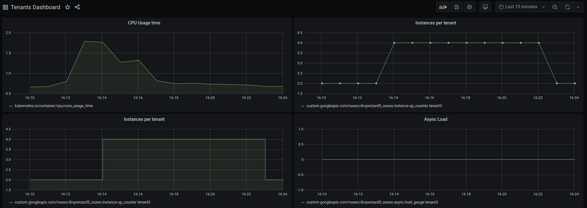
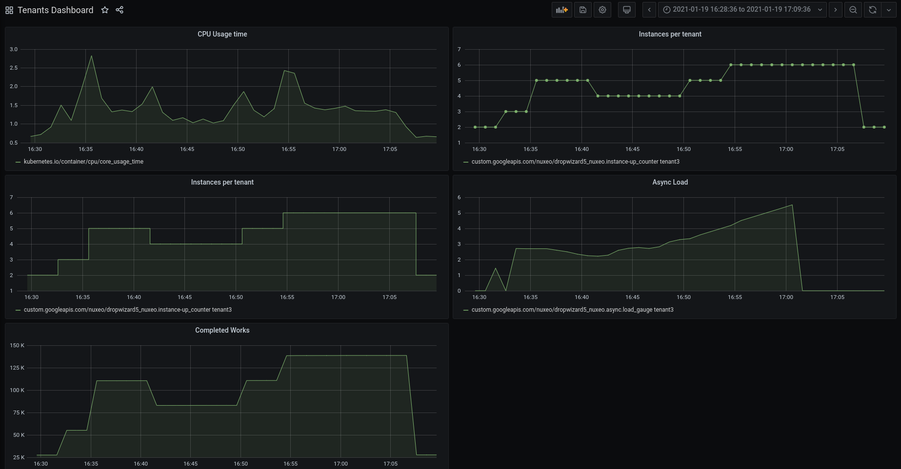

## Principles

The standard Nuxeo deployment contains 2 types of nodes:

 - API nodes: handling the synchronous workload
 - worker nodes: handling the asynchronous workload

In K8S, these 2 types of nodes are deployed via 2 dedicated deployments using the same Docker image with just a few minor configuration differences.

The goal is to scale the 2 deployments up/down depending on the load.

Typically:

 - API nodes should be scaled out when too much synchronous load is applied
    - typically, too much CPU or memory pressure
 - worker nodes should be scaled out when the lag is too big
    - size of the queues and lags of stream processors

## Metrics 

### Generic Nuxeo Metrics

Nuxeo uses Coda Hale Yammer Metrics to expose Nuxeo specific metrics.

See: https://doc.nuxeo.com/nxdoc/metrics-and-monitoring/

Nuxeo exposes a lot of metrics (JVM, Tomcat, Repository, Stream processing, Work Manager ...), and then you need to configure how to access and view the metrics:

 - JMX access
 - export to DataDog
 - export to Grafana
 - export to StackDriver
 - ...

For reference, see: 

 - [default configuration template](https://github.com/nuxeo/nuxeo/blob/master/server/nuxeo-nxr-server/src/main/resources/templates/common-base/nxserver/config/metrics-config.xml)
 - [available reporters](https://github.com/nuxeo/nuxeo/tree/master/modules/runtime/nuxeo-runtime-metrics/src/main/java/org/nuxeo/runtime/metrics/reporter)

In the context of GKE, we use the StackDriver reporter.

### StackDriver for GCP/GKE and specificities for the K8S HPA

[Horizontal Pod Autoscaler (HPA)](https://kubernetes.io/docs/tasks/run-application/horizontal-pod-autoscale/) is a standard mechanism to handle AutoScaling at the K8S level

The principle is to associate a metric and a threshold to a K8S deployment and scale out/down depending on the variation of the target metric.

For the K8S pod autoscaler to work, the metrics exposed need to be tagged with the correct resource type; otherwise, the HPA will complain that it can not read the metrics.

In GKE, we use `StackDriver` and the default resource type in opencensus is set to `k8s_container`, whereas it needs to be `k8s_pod` for the HPA to be able to read it.

In order to work around that, the deployed image include the [k8s-hpa-metrics](https://github.com/tiry/nuxeo-tenant-test-image/tree/master/plugins/k8s-hpa-metrics) addon that:

 - properly tag resources and metrics
 - exposes additional metrics dedicated to asynchronous workload

Because of the first point, the helm values files looks like this:
    ...
    metrics:
        enabled: true
        stackdriver:
            enabled: false
    ...
  
It means that we disable the default stackdriver reporter and rely on the fact the the [k8s-hpa-metrics specific reporter](https://github.com/tiry/nuxeo-tenant-test-image/blob/master/plugins/k8s-hpa-metrics/src/main/resources/OSGI-INF/metrics-config.xml) is activated.

For the second point, the addon expose an aggregated metrics called `nuxeo.async.load` that is based on:

how many asynchronous tasks are queued in `nuxeo-stream` or the WorkManager 
the lag
how fast jobs are processed
the latency 

## Deploying HPA

Use the `deploy-hpa.sh`:

 - first arg should be the target namespace
 - second arg should be the name of the company (what was used to create the deployment name)

Typically, for a tenant named `company-c` and deployed in namespace `tenant3`:

   ./deploy-hpa.sh tenant3 company-c

To verify that everything works:

    kubectl get hpa  -n tenant3 

    NAME                        REFERENCE                           TARGETS   MINPODS   MAXPODS   REPLICAS   AGE
    nuxeo-company-c-async-hpa   Deployment/nuxeo-company-c-worker   0/900m    1         5         1          7m51s
    nuxeo-company-c-cpu-hpa     Deployment/nuxeo-company-c-api      6%/80%    1         5         1          7m52s

NB: the name of the metric used in the HPA depends on the underlying monitoring system: typically since here we go through StackDriver the Nuxeo metrics name is changed.
For example:

name at the nuxeo level

    nuxeo.async.load

name in stack  driver

    custom.googleapis.com|nuxeo|dropwizard5_nuxeo.async.load_gauge

## Testing Autoscaling

### Simple load testing

The [k8s-hpa-metrics](https://github.com/tiry/nuxeo-tenant-test-image/blob/master/plugins/k8s-hpa-metrics/src/main/resources/OSGI-INF/operation-contrib.xml) provides 2 Automation Operation that allow simulating load on the Nuxeo side.

This is very basic and not as meaningful as the [default Gatling tests that are part of the Nuxeo Server distribution](https://github.com/nuxeo/nuxeo/tree/master/ftests/nuxeo-server-gatling-tests/src/test/scala/org/nuxeo/cap/bench): but it allows to conduct a simple test to check that autoscaling works.

### API Nodes

#### Generating load to validate Scale-out

In this example, we will generate load on `company-c` that is hosted in `tenant3`

    ./inject_cpu_load.sh company-c

#### Checking deployment autoscaling

You can check the Events in the corresponding deployment.

    kubectl describe deployment nuxeo-company-c-api -n tenant3

    Name:                   nuxeo-company-c-api
    Namespace:              tenant3
    ...
    Events:
        Type    Reason             Age   From                   Message
        ----    ------             ----  ----                   -------
        Normal  ScalingReplicaSet  60m   deployment-controller  Scaled up replica set nuxeo-company-c-api-69978c67f8 to 1
        Normal  ScalingReplicaSet  7m4s  deployment-controller  Scaled up replica set nuxeo-company-c-api-69978c67f8 to 3
        Normal  ScalingReplicaSet  4s    deployment-controller  Scaled down replica set nuxeo-company-c-api-69978c67f8 to 1

You can also check the HPA

    kubectl describe  hpa nuxeo-company-c-api   -n tenant3

    Name:                                                  nuxeo-company-c-api
    Namespace:                                             tenant3
    ...
    Min replicas:                                          1
    Max replicas:                                          5
    Deployment pods:                                       1 current / 1 desired
    Conditions:
    Type            Status  Reason              Message
    ----            ------  ------              -------
    AbleToScale     True    ReadyForNewScale    recommended size matches current size
    ScalingActive   True    ValidMetricFound    the HPA was able to successfully calculate a replica count from cpu resource utilization (percentage of request)
    ScalingLimited  False   DesiredWithinRange  the desired count is within the acceptable range
    Events:
    Type    Reason             Age    From                       Message
    ----    ------             ----   ----                       -------
    Normal  SuccessfulRescale  7m37s  horizontal-pod-autoscaler  New size: 3; reason: cpu resource utilization (percentage of request) above target
    Normal  SuccessfulRescale  37s    horizontal-pod-autoscaler  New size: 1; reason: All metrics below target

#### Monitoring

The screenshot below shows how API nodes auto-scale when CPU load is applied.

The current dashboard show only one tenant deployed with initially 1 API node and 1 worker node.

### Worker nodes

#### Generating load to validate Scale-out

In this example, we will generate async workload on `company-c` that is hosted in `tenant3`

    ./inject_worker_load.sh company-c

#### Checking deployment autoscaling

You can check the Events in the corresponding hpa

    kubectl describe hpa nuxeo-company-c-worker -n tenant3
    
    Name:                                                          nuxeo-company-c-worker
    Namespace:                                                                   tenant3
    ...
    Events:
    Type    Reason             Age   From                       Message
    ----    ------             ----  ----                       -------
    Normal  SuccessfulRescale  27m   horizontal-pod-autoscaler  New size: 2; reason: pods metric custom.googleapis.com|nuxeo|dropwizard5_nuxeo.async.load_gauge above target
    Normal  SuccessfulRescale  18m   horizontal-pod-autoscaler  New size: 3; reason: pods metric custom.googleapis.com|nuxeo|dropwizard5_nuxeo.async.load_gauge above target
    Normal  SuccessfulRescale  8m7s  horizontal-pod-autoscaler  New size: 1; reason: All metrics below target

#### Monitoring

The screenshot below shows how Worker nodes auto-scale when ASync workload is applied.

The current dashboard show only one tenant deployed with initially 1 API node and 1 worker node.

## Scale to 0 - WIP / ideas

### Goal

The goal is to be able to autoscale to 0 when there is no workload.
The idea is to make an inactive tenant very cheap to run, while allowing to quickly scale as soon as the workload increases.

We want to consider 3 cases of workload to autoscale

#### API node / Interactive workload

To enable scaling to 0 we need 2 things

 - have an ingress that can drives autoscaling depending on incomming load
    - KNative / Istio seem to be a solution
 - make Nuxeo start within 10s
    - skip initContainers
    - run pre-processing outside of the Docker filesystem

#### Worker nodes

For worker nodes, scaling down to 0 would be great, but:

 - if we have no worker node, we have nothing to report the lag metrics
    - would need to run the underlying computation on a api node
 - standard HPA does not support scaling to 0
    - would need KPA from KServe (KNative)

We could also just make that Nuxeo container does not start until needed:
  
  - add initContainer that way for work to do
  - add check & wait in Nuxeo Docker EntryPoint

=> Could use a kafka/stream.sh command to check if there is pending work.  

The best option would probably be to use an Operator that can encapsulate all the logic.

#### Custom on demand workload

Typical examples would be:

 - conversion jobs
 - custom / business specific processing

We need :

 - a queuing / event system
    - KEvent / CloudEvent
 - Consumers / Producers
    - KServe?

