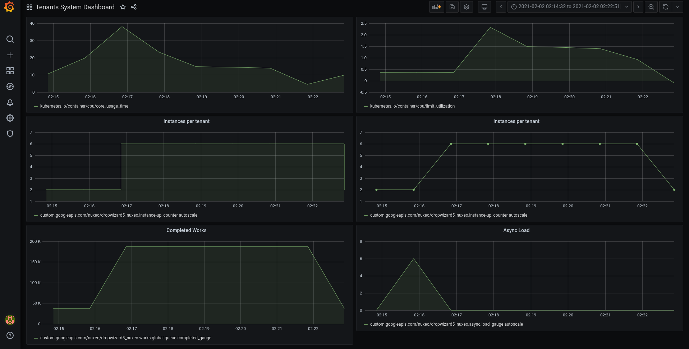
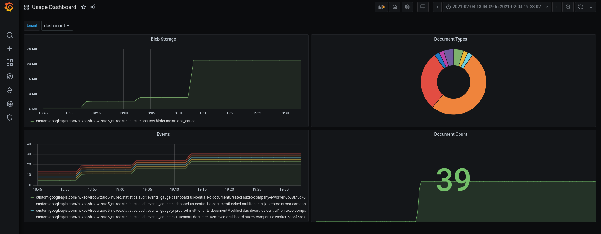

## Principles

Here the goal is to deploy Grafana and have dashboards allowing to monitor each deployed tenant.

## Deploying Grafana

This doc is based on this [GCP documentation page](https://cloud.google.com/community/tutorials/visualizing-metrics-with-grafana)

Deploy the Graphana Helm chart in a dedicated namespace

    helm3 upgrade -i grafana grafana \
     --repo https://grafana.github.io/helm-charts \
	 --version 6.1.15 \
     -n nx-monitoring --create-namespace \
	 -f values.yaml

Get the password for the `admin` user

    kubectl get secret --namespace nx-monitoring grafana -o jsonpath="{.data.admin-password}" | base64 --decode ; echo

Configure Cloud Monitoring data source

 - In the Grafana UI, click Add data source.
 - Click Stackdriver (now called Google Cloud Monitoring)
 - Switch Authentication Type to Default GCE Service Account. Note that this works because Grafana is running on a GKE cluster with default access scopes configured.
 - Click Save and Test.

## Accessing the dashboard

### use port forwarding

You can use k8s native feature sto expose locally Grafana:

    export POD_NAME=$(kubectl get pods --namespace nx-monitoring -l "app.kubernetes.io/name=grafana,app.kubernetes.io/instance=grafana" -o jsonpath="{.items[0].metadata.name}")

    kubectl --namespace nx-monitoring port-forward $POD_NAME 3000

### Expose via ingress

A better option is to deploy an ingress:

Just run the provided script that will create a k8s ingress: 

    ./deploy-grafana-ingress.sh

## Example Dashboards

### System Dashboard

Monitor key components used to determine HPA/Autoscale

[json definition](dashboard.json)

### Usage Dashboard

Display some usage statistics.

based on addon: [nuxeo-statistics](https://github.com/nuxeo-sandbox/nuxeo-statistics)

[json definition](usage-dashboard-with-pie.json)

